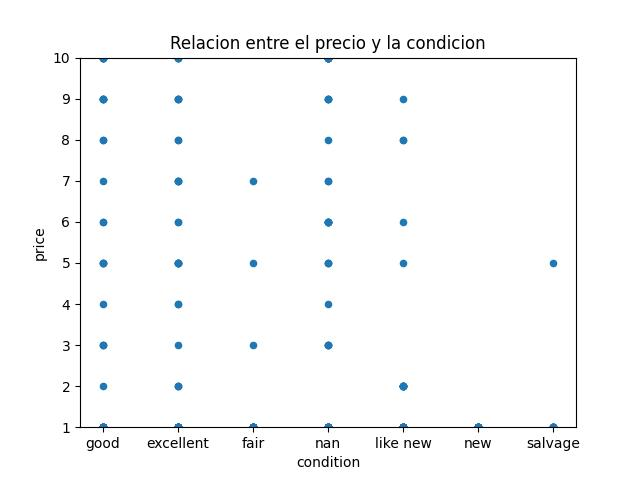

# Grafico de relacion entre el precio y la condicion del vehiculo

El diagrama de dispersión muestra la relación entre la condición de un vehículo y su precio. El eje y muestra los precios del vehículo, que se clasifica en una escala del 1 al 10, siendo 1 el mas barato y 10 el mas caro. El eje x muestra la calidad del vehículo.

El diagrama de dispersión muestra que existe una relación positiva entre la condición de un vehículo y su precio. Esto significa que los vehículos en mejores condiciones tienden a ser más caros que los vehículos en peores condiciones.
Esta relación probablemente se deba al hecho de que los vehículos en mejores condiciones tienen más probabilidades de estar en demanda y, por lo tanto, son más valiosos.
